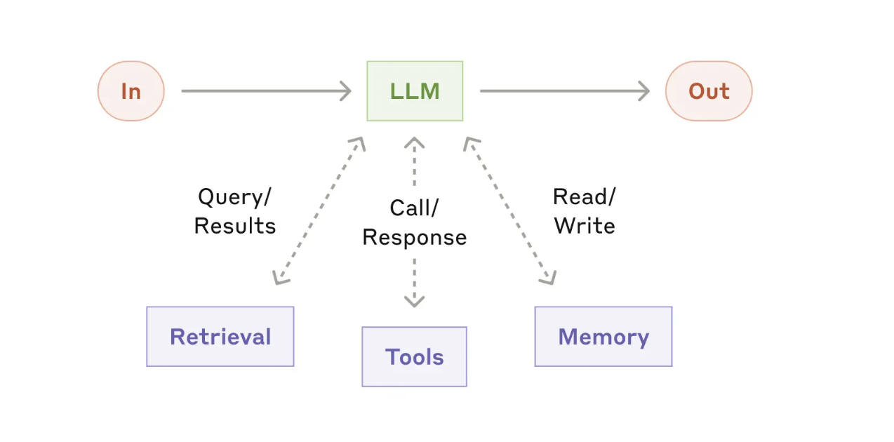

# AI Agents: Visual Guide to Building Effective Systems

AI agents represent a shift from hardcoded logic to LLM-controlled workflows. The most successful implementations? They're surprisingly simple, using composable patterns rather than complex frameworks.

## Start Here: The Augmented LLM Foundation



Everything starts with this - an LLM enhanced with three key capabilities:

- **Retrieval**: Query external knowledge sources and databases
- **Tools**: Call APIs and interact with external services  
- **Memory**: Read and write persistent context

The LLM actively manages these capabilities, deciding when and how to use each one. This is your foundation before you add any complexity.

```python
# Basic augmented LLM structure
def augmented_llm(user_input, context):
    # LLM can choose to:
    retrieved_info = retrieval_system.search(user_input)  # Get info
    tool_result = tools.call_api(user_input)              # Use tools
    context = memory.update(user_input, context)          # Remember
    
    response = llm_call(user_input, retrieved_info, tool_result, context)
    return response
```

## Simple Workflow Patterns

### 1. Prompt Chaining with Gates


The simplest multi-step pattern:
- Break task into sequential steps
- Each LLM call processes previous output
- Gates validate intermediate results
- Fail fast if something goes wrong

**When to use**: Tasks that decompose cleanly into fixed sequential steps.

```python
def gated_chain(input_data):
    step1_output = llm_call_1(input_data)
    
    if not validate_step1(step1_output):
        return error_exit("Step 1 validation failed")
    
    step2_output = llm_call_2(step1_output)
    step3_output = llm_call_3(step2_output)
    
    return step3_output
```

**Example**: Generate marketing copy → check brand guidelines → translate to target language

### 2. Routing


Like a smart switchboard:
- Router LLM classifies the input type
- Directs to specialized follow-up tasks
- Each path optimized for specific scenarios

**When to use**: Distinct input categories that need different handling.

```python
def routing_workflow(user_input):
    category = router_llm(user_input)
    
    if category == "technical_support":
        return technical_llm(user_input)
    elif category == "billing":
        return billing_llm(user_input)
    elif category == "general":
        return general_llm(user_input)
```

**Example**: Customer service - route technical issues to one flow, billing to another

### 3. Parallelization


Two main flavors:
- **Sectioning**: Break into independent parallel subtasks
- **Voting**: Run same task multiple times for consensus

**When to use**: Tasks that benefit from multiple perspectives or can be divided for speed.

**Example**: Code review where different LLMs check security, performance, and style simultaneously

## Intermediate Workflow Patterns

### 4. Evaluator-Optimizer


Two LLMs working in tandem:
- Generator creates potential solutions
- Evaluator provides detailed feedback
- Loop continues until solution meets criteria
- Only accepted solutions become output

**When to use**: Clear evaluation criteria and iterative improvement adds measurable value.

```python
def evaluator_optimizer(input_task):
    max_iterations = 5
    
    for i in range(max_iterations):
        solution = generator_llm(input_task)
        evaluation = evaluator_llm(solution, criteria)
        
        if evaluation.accepted:
            return solution
        else:
            input_task += f"Feedback: {evaluation.feedback}"
    
    return best_solution_so_far
```

**Example**: Literary translation with critique and refinement cycles

### 5. Orchestrator-Workers  


More sophisticated parallel processing:
- Orchestrator analyzes input and creates dynamic work plan
- Delegates subtasks to specialized worker LLMs
- Synthesizer combines all results into coherent output

**When to use**: Complex tasks where subtasks can't be predicted upfront but can be parallelized.

**Example**: Research tasks requiring analysis of multiple sources with different expertise areas

## True Agent Patterns

### 6. Basic Autonomous Agent


The fundamental agent pattern:
- LLM autonomously takes actions in environment
- Gets concrete feedback from results
- Human can intervene at any decision point
- Stop conditions prevent runaway processes

**When to use**: Open-ended tasks where step count can't be predicted.

```python
def basic_agent(task):
    while not task_complete and steps < max_steps:
        action = llm_decide_action(task, current_state)
        result = execute_action(action)
        feedback = get_environment_feedback(result)
        
        current_state = update_state(feedback)
        
        if should_ask_human(current_state):
            human_input = get_human_feedback()
            current_state = incorporate_feedback(current_state, human_input)
    
    return final_result
```

### 7. Advanced Coding Agent


The most sophisticated pattern shown:

**Phase 1 - Clarification**:
- Human provides initial query through interface
- LLM asks clarifying questions until requirements are crystal clear
- Iterative refinement of task understanding

**Phase 2 - Autonomous Execution**:
- Agent searches relevant files in codebase
- Writes code based on context and requirements
- Runs tests to validate changes
- Gets concrete pass/fail feedback
- Iterates until all tests pass

**Phase 3 - Completion**:
- Signals task completion
- Returns results to human via interface

**When to use**: Complex coding tasks requiring multiple file changes and testing validation.

```python
def coding_agent_flow(task_description):
    # Phase 1: Clarification
    while not task_clear:
        clarification = llm_call("Clarify requirements", task_description)
        task_description = get_human_input(clarification)
    
    # Phase 2: Autonomous execution
    while not tests_pass and attempts < max_attempts:
        context = search_files(task_description)
        code = llm_call("Write code", context)
        test_results = run_tests(code)
        
        if not test_results.success:
            task_description += f"Test feedback: {test_results.details}"
    
    # Phase 3: Completion
    return final_solution
```

## The Progression: Start Simple, Add Complexity Only When Needed

Follow this natural progression:

1. **Single augmented LLM call** - Most problems start and end here
2. **Simple workflows** - Prompt chaining, routing when tasks decompose cleanly
3. **Intermediate patterns** - Evaluator-optimizer, orchestrator-workers for complex but predictable tasks
4. **True agents** - Only for genuinely open-ended problems in trusted environments

## Critical Success Factors

### Environment Feedback is Everything
Notice how the most complex pattern (coding agent) has the clearest feedback - test results. Agents need "ground truth" at each step:
- Code execution results
- API response codes  
- Test outcomes
- User validation

### Design Your Agent-Computer Interface
Tools deserve as much attention as prompts:
- Use formats the model has seen in training
- Avoid formatting overhead (line counts, escaping)
- Provide clear examples and edge cases
- Test extensively with real inputs

### Human Intervention Points
Even autonomous agents need checkpoints where humans can provide guidance or course correction.

### Stopping Conditions
Always include maximum iteration limits to prevent runaway processes.

## Real-World Success Stories

**Customer Support**: Routing + tool integration for data access. Companies use usage-based pricing because they're confident in resolution rates.

**Coding Agents**: The complex pattern works because outputs are verifiable through automated tests. Clear feedback enables effective iteration.

## Framework Reality Check

LangGraph, Bedrock, Rivet, Vellum - they help you get started. But they add abstraction layers that can make debugging harder. Many of these patterns need just a few lines of direct API calls.

Start simple. Use frameworks if they help, but understand what's underneath.

## The Bottom Line

Success isn't about building the most sophisticated system. It's about solving the actual problem effectively.

Start with an augmented LLM. Get that right. Add workflow patterns only when tasks genuinely require multiple steps. Move to true agents only for open-ended problems where you can't predict the solution path.

The patterns build on each other - master the simpler ones before attempting the complex coding agent flow.